# PODCASTR PROJECT

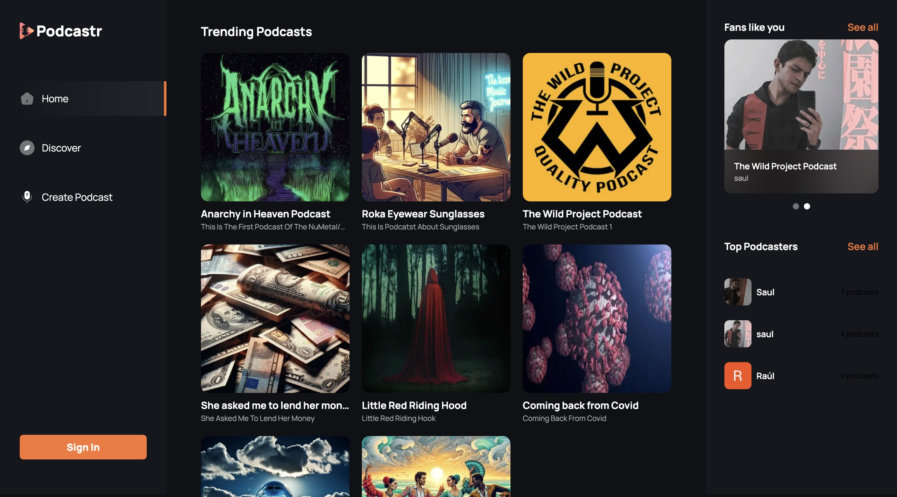
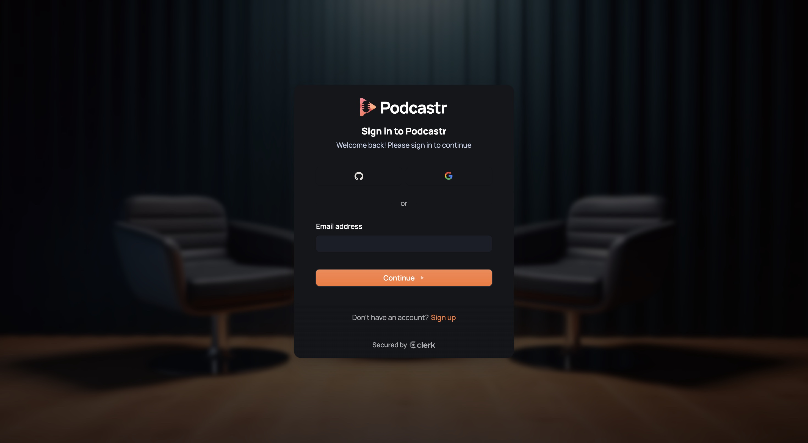
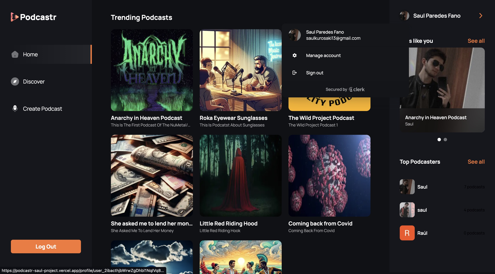
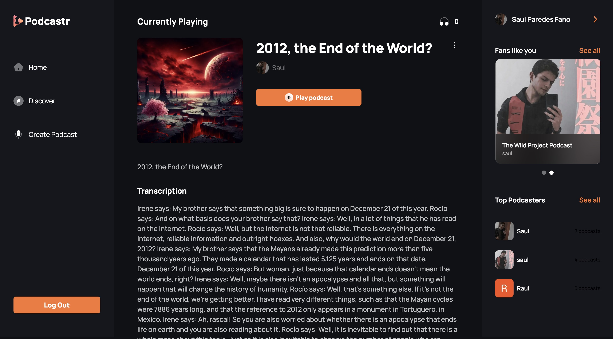
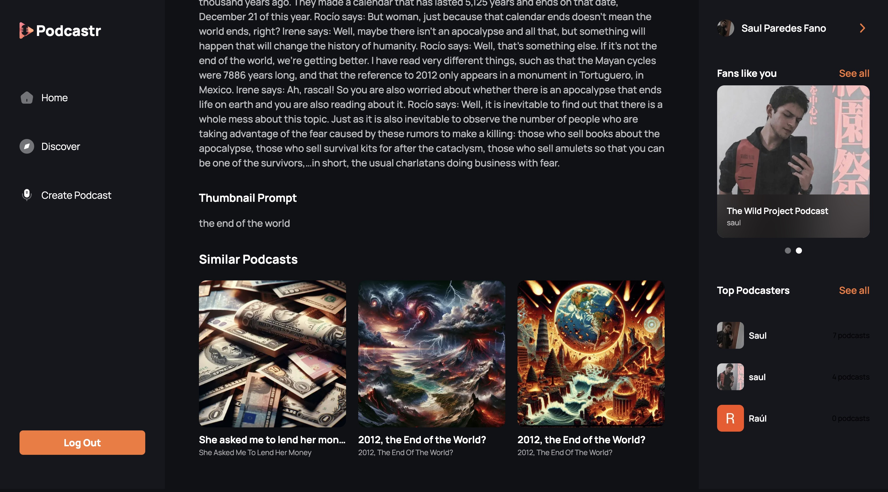
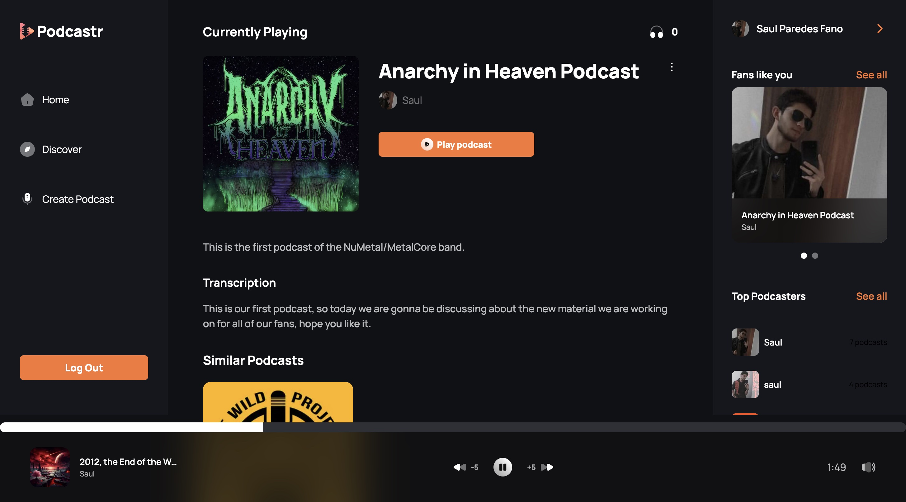
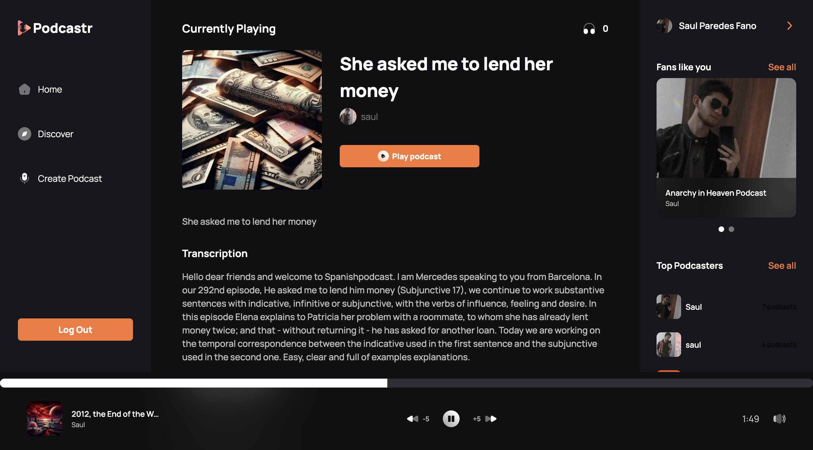
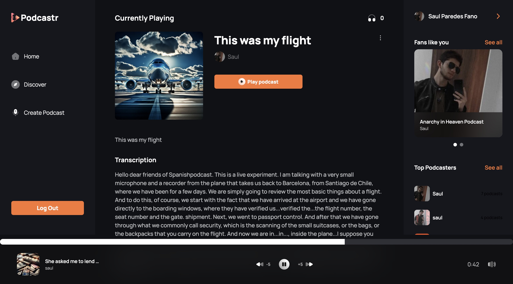
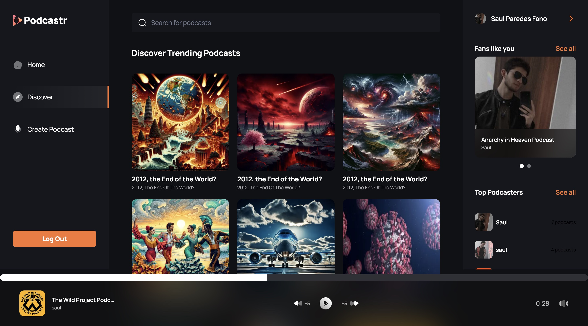
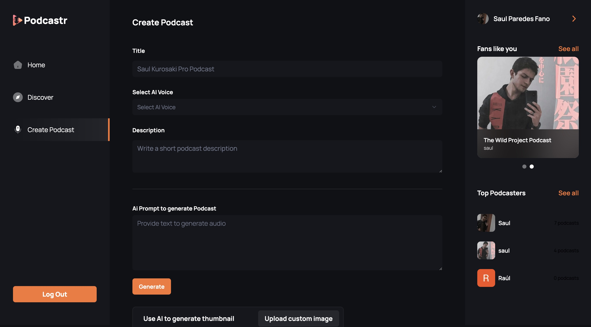
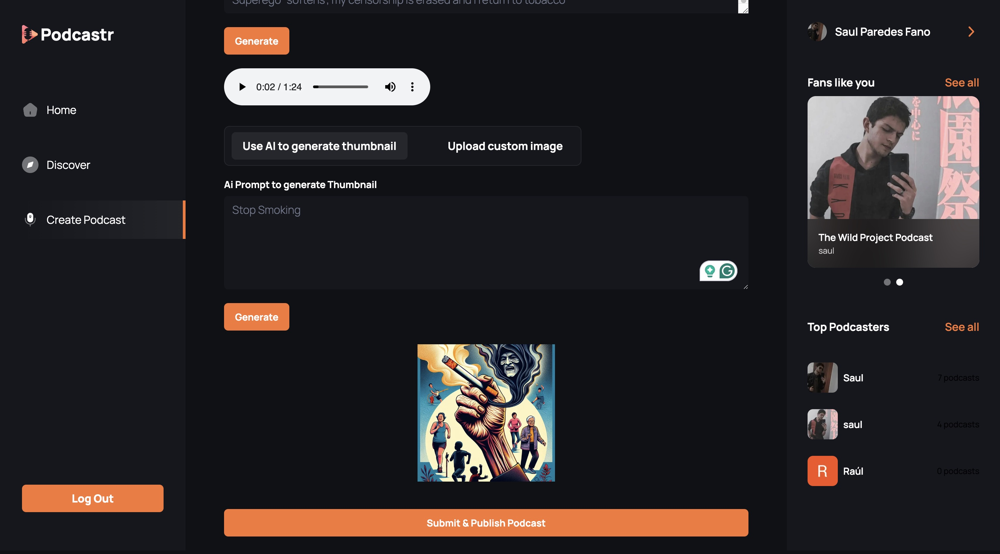
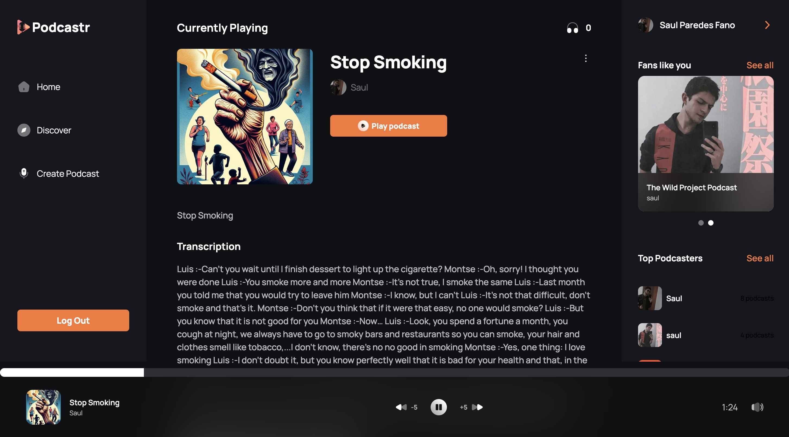
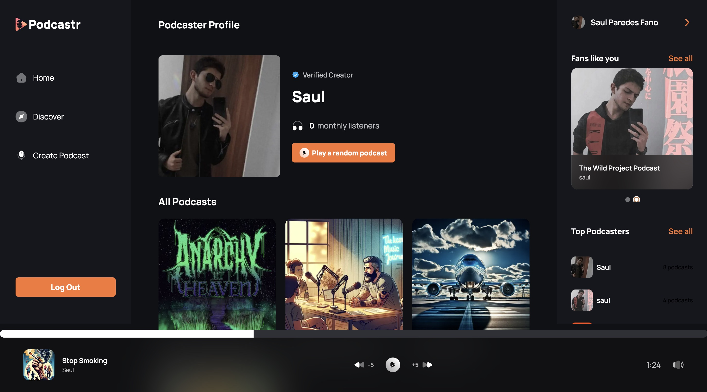
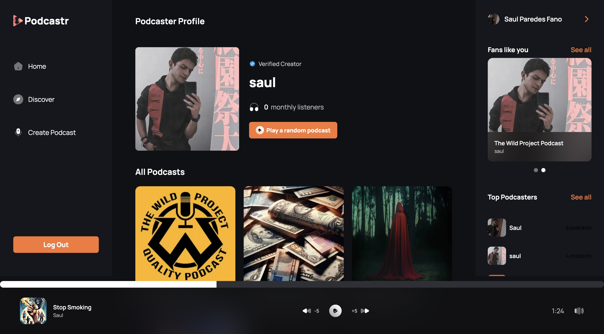

## <a name="tech-stack">⚙️ Tech Stack</a>

- Next.js
- TypeScript
- Convex
- OpenAI
- Clerk
- ShadCN
- Tailwind CSS

## <a name="features">🔋 Features</a>

👉 **Robust Authentication**: Secure and reliable user login and registration system.

👉 **Modern Home Page**: Showcases trending podcasts with a sticky podcast player for continuous listening.

👉 **Discover Podcasts Page**: Dedicated page for users to explore new and popular podcasts.

👉 **Fully Functional Search**: Allows users to find podcasts easily using various search criteria.

👉 **Create Podcast Page**: Enables podcast creation with text-to-audio conversion, AI image generation, and previews.

👉 **Multi Voice AI Functionality**: Supports multiple AI-generated voices for dynamic podcast creation.

👉 **Profile Page**: View all created podcasts with options to delete them.

👉 **Podcast Details Page**: Displays detailed information about each podcast, including creator details, number of listeners, and transcript.

👉 **Podcast Player**: Features backward/forward controls, as well as mute/unmute functionality for a seamless listening experience.

👉 **Responsive Design**: Fully functional and visually appealing across all devices and screen sizes.

and many more, including code architecture and reusability
